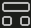

# Lingua Franca Workshop
The objective of this workshop is to get familiar with basic features of Lingua Franca. We will go a step further to discuss how it can be applied for the development of time critical software applications. 

We recommend visiting the [Lingua Franca](https://www.lf-lang.org/) project page for more details.


## Development Environment

We have created two development environments for you to try the workshop examples. [Gitpod](http://gitpod.io) and [Codespaces](https://github.com/codespaces/) allow you to launch the containerized environment and support editing in [VS Code](https://code.visualstudio.com/) (Browser based or Desktop version).

**You are responsible for the costs incurred for working on both these environments. Kindly review the pricing and make sure you maximize your free credits as an individual user.**

 - [GitHub Codespaces Pricing](https://docs.github.com/en/billing/managing-billing-for-github-codespaces/about-billing-for-github-codespaces)
 - [Gitpod Pricing](https://www.gitpod.io/pricing)

If you are not comfortable with the above environments, please follow the links below to build the development environment on your compute machine.
 - [Download and build](https://www.lf-lang.org/download)
 - [Install RTI for C](https://www.lf-lang.org/docs/handbook/distributed-execution?target=c#installation-of-the-rti)


## Launching your development environment
[](https://github.com/codespaces/new?hide_repo_select=true&ref=main&repo=598781284&devcontainer_path=.devcontainer%2Fdevcontainer.json&location=WestUs2)

[](https://gitpod.io/#https://github.com/DensoSVIC/lf-workshop.git)

<!--- 
### Launch containerized version
[](https://github.com/codespaces/new?hide_repo_select=true&ref=main&repo=598781284&devcontainer_path=.devcontainer%2Fcontainerized%2Fdevcontainer.json&location=WestUs2)
-->
Your environment can take up to a few minutes to build the container image and load the editor. Once you pass this step, you are ready for the LF programming experience!

## Getting started with the exercises
Make sure you have the compiler built in the previous step by bringing up the terminal in the editor and typing in `lfc`. By default, the terminal points to 'lf-workshop' directory. To run an example, use the command `lfc src/<example>.lf` to build and run the generated binary `bin/<example>`.
```
$lfc src/HelloWorld.lf
$bin/HelloWorld
```

You can also use the features of the in-built editor by pressing `ctrl+shift+p` and selecting `Lingua Franca: Build and Run` option which builds and runs the program for you. To render the diagram view of your Lingua Franca code, click the  icon on the top right corner of the editor window in which the `.lf` program is opened.

## Tutorial
### Exercise 1
*Running a simplest LF application to familiarize with concepts of the meta language*

1. Open `src/HelloLF.lf` in editor.
- Go through the syntax and key words
- Diagrammatic view of the LF program
- Observe generated code and compare with equivalent non-LF code (`artifacts/HelloWorld.c`)
- Polyglot test in CPP/Python (`src/HelloLFPy.lf` and `src/HelloLFCpp.lf`)
2. Trigger reaction with periodic timer
3. Print logical and physical time at each trigger
4. Explore target properties (eg: `timeout`)
5. Include preamble code
6. State variables

### Exercise 2 
*Building composite reactors*
1. Open `src/Composition.lf` in editor.
2. Multiple reactors
3. Import mechanism
4. Banks of reactors
5. A note on Determinism using `src/Determinism.lf`
5. Open `src/Modal.lf` for Modal models 
6. Add a third mode with 

### Exercise 3
*Understanding LF time syntax*
1. Open `src/PhyLogTimes.lf` in editor.
- Understand that logical time advances only on an event while physical time advances irrespective
2. Open `src/Logical.lf` in editor and observe multisource pattern.
3. Deadline handling mechanism using `src/Deadline.lf`
4. Logical and physical actions (Optional)
5. Physical connection (Optional)

### Exercise 4
*Developing distributed applications*
1. Open `src/HelloWorldFederated.lf` in editor.
2. Explore centralized vs distributed coordination
3. Containerized execution

### Exercise 5
*A real life application - door lock example*
1. Open `src/DoorLock/DoorLock.lf` in editor.
2. Detect cases of non-determinism

## Before you leave
When you are done with the workshop, cleanup unused/stopped instances you may have created during the event to avoid being billed.
* [on Github](https://github.com/codespaces/)
* [On Gitpod](https://gitpod.io/workspaces)


## Acknowledgements
We extend our sincere thanks to [Prof. Edward Lee](https://www2.eecs.berkeley.edu/Faculty/Homepages/lee.html) and to the amazing [Lingua Franca community](https://www.lf-lang.org/community). The scripts used for containerized development environments have been borrowed with permission from [Lingua Franca playground repository](https://github.com/lf-lang/lingua-franca-playground). 